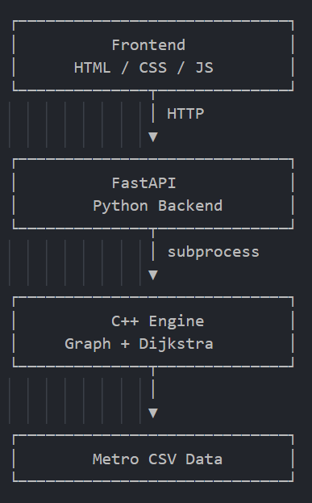
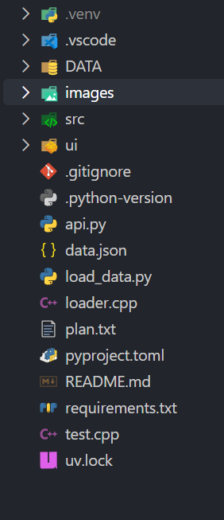
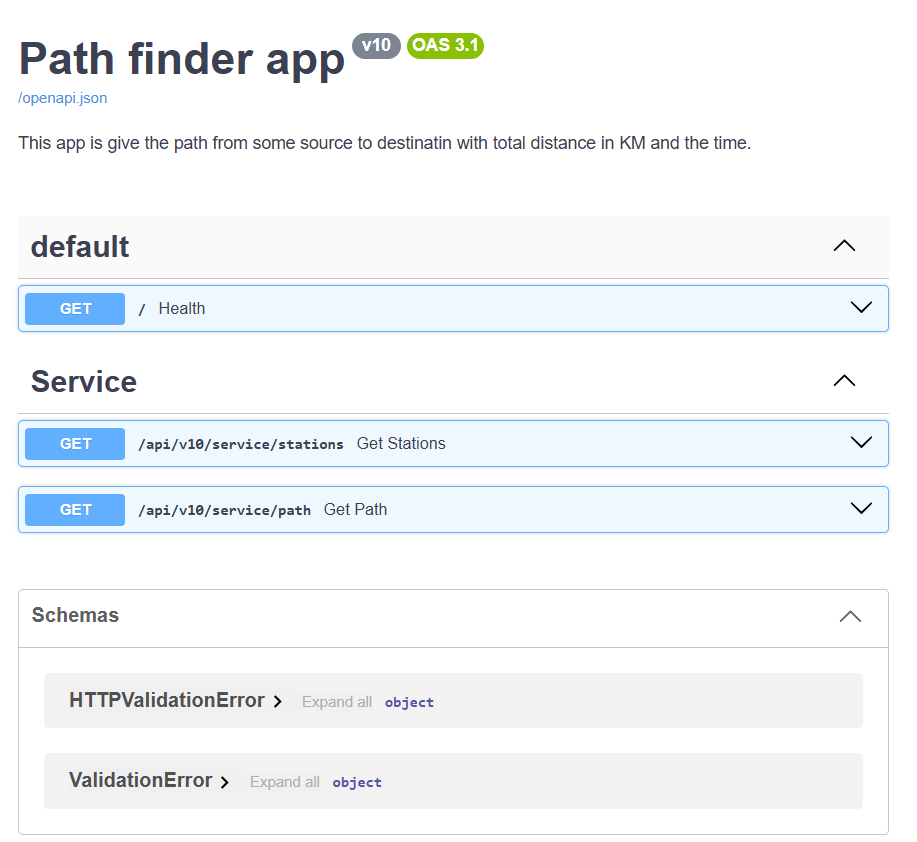
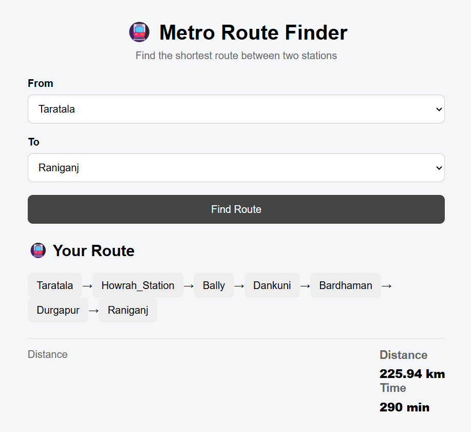

🚇 Metro Route Finder
Live link: https://path-finder-kbhazra.netlify.app/

A metro route-finding application that uses Dijkstra's Shortest Path Algorithm to calculate the shortest route between two metro stations.

The project combines a C++ DSA engine with a Python FastAPI backend and a simple HTML/CSS/JavaScript frontend.

---

📌 Overview

Metro Route Finder allows users to:

- Select a source station
- Select a destination station
- Find the shortest route between them
- View the stations included in the route
- View the total distance
- View the estimated travel time

The core route calculation is implemented in C++ using Dijkstra's algorithm.

---

🏗️ Architecture

Why C++ + Python?

The project separates the algorithmic layer from the application/API layer.

- C++ → Graph construction, Dijkstra algorithm
- Python/FastAPI → CSV loading and API layer and communication with the C++ executable
- JavaScript → User interface and API communication

---

🧠 Core Algorithm

The metro network is represented as a weighted undirected graph.

Each station is a vertex:

Station → Vertex

Each connection between two stations is an edge:

Station A ─── distance ─── Station B

For example:

Taratala ── 2.01 km ── New Alipore ── 2.00 km ── Kalighat

The project uses Dijkstra's Shortest Path Algorithm to find the minimum-distance route.

Priority Queue

Dijkstra uses a min-priority queue to process the station with the smallest currently known distance.

Conceptually:

Source
  ↓
Nearest unprocessed station
  ↓
Relax connected stations
  ↓
Update shorter distances
  ↓
Repeat

Path Reconstruction

Along with the distance array, the algorithm maintains a "parent" array.

For example:

parent[Kalighat] = New Alipore
parent[New Alipore] = Taratala

This allows the final route to be reconstructed:

Taratala
   ↓
New Alipore
   ↓
Kalighat

---

📂 Project Structure

A simplified structure looks like:

«The exact structure may vary depending on the current implementation.»

---

📊 Metro Data

The C++ program loads metro connection data from a CSV file.

Example:

station1,station2,distance,time
Taratala,New_Alipore,2.01,35.6
New_Alipore,Kalighat,2.00,20.1

The station names are mapped to integer IDs internally:

Taratala     → 0
New_Alipore  → 1
Kalighat     → 2

This allows the graph to efficiently work with integer vertex IDs while the application still exposes human-readable station names.

---

🔌 API

The FastAPI backend currently exposes three main endpoints.

"GET /health"

Checks whether the backend is running.

Example:

{
  "status": "ok"
}

---

"GET /stations"

Returns the available metro stations.

Example:

{
  "stations": [
    "Taratala",
    "New_Alipore",
    "Kalighat"
  ]
}

---

"GET /path"

Finds the shortest route between two stations.

Example request:

/path?source=Taratala&destination=Kalighat

Example response:

{
  "source": "Taratala",
  "destination": "Kalighat",
  "distance_km": 4.01,
  "time_min": 10,
  "path": [
    "Taratala",
    "New_Alipore",
    "Kalighat"
  ]
}

---

🖥️ Frontend

The frontend is intentionally built using simple web technologies:

- HTML
- CSS
- JavaScript
- Fetch API

The station list is loaded dynamically from:

GET /stations

When the user selects two stations and clicks Find Route, the frontend calls:

GET /path

and displays:

Source → Intermediate Stations → Destination

along with:

Distance
Estimated Time

---

🔄 Request Flow

When the user searches for a route:

1. User selects source and destination
              ↓
2. Frontend calls FastAPI /path
              ↓
3. FastAPI starts the C++ executable
              ↓
4. C++ receives station names as command-line arguments
              ↓
5. C++ finds their station IDs
              ↓
6. Dijkstra calculates shortest distances
              ↓
7. Parent array reconstructs the route
              ↓
8. C++ returns JSON through stdout
              ↓
9. Python parses the JSON
              ↓
10. FastAPI returns JSON to frontend
              ↓
11. Frontend displays the route

---

⚙️ Technologies Used

Technology| Purpose
C++| Graph and Dijkstra implementation
STL| "vector", "unordered_map", "priority_queue", etc.
Python| Backend integration
FastAPI| REST API
HTML| UI structure
CSS| UI styling
JavaScript| Frontend logic and API calls
CSV| Metro network data

---

⏱️ Complexity

For a graph with:

- "V" = number of stations
- "E" = number of connections

Using an adjacency list and a binary heap priority queue:

Time Complexity:  O((V + E) log V)

Space Complexity: O(V + E)

The algorithm runs once for each route request.

---

▶️ Running the Project

1. Clone the repository

git clone <your-repository-url>
cd metro-route-finder

2. Compile the C++ engine

Example:

g++ src/engine/algo.cpp

Make sure the generated executable is available to the backend.

3. Install Python dependencies

pip install -r requirements.txt

4. Start FastAPI

For example:

uvicorn backend.main:app --reload

The API will be available at:

http://127.0.0.1:8000

5. Open the frontend

Open:

frontend/index.html

in your browser.

---

🧪 Example

Input:

Source: Taratala
Destination: Kalighat

Output:

Route:

Taratala
   ↓
New_Alipore
   ↓
Kalighat

Distance: 4.01 km
Estimated Time: 10 min

---

🎯 Project Goals

This project was built to demonstrate how a classical DSA algorithm can be integrated into a real application.

The main learning objectives are:

- Implementing graphs using adjacency lists
- Understanding weighted graphs
- Implementing Dijkstra's algorithm
- Using a priority queue for efficient shortest-path calculation
- Reconstructing paths using parent nodes
- Loading graph data from CSV
- Passing arguments between Python and C++
- Returning JSON from a C++ program
- Building REST APIs with FastAPI
- Connecting a frontend to a backend API
- Separating algorithm, backend and UI layers

---

🚀 Future Improvements

Possible future enhancements include:

- Interactive metro map
- Station search/autocomplete
- Multiple route options
- Route visualization
- Line/interchange information
- Better travel-time estimation
- Persistent database storage
- Admin API for adding/updating stations
- Docker deployment
- Production-grade error handling
- Improved frontend design

---

📚 What I Learned

This project helped connect theoretical DSA concepts with an actual software application.

Instead of implementing Dijkstra as an isolated console program, the algorithm is used as a real route calculation engine that communicates with a backend API and frontend.

DSA Algorithm
      ↓
C++ Engine
      ↓
FastAPI
      ↓
Frontend
      ↓
Real User Interaction

---

👨‍💻 Author

Kanchan Baran Hazra

B.Tech — Artificial Intelligence & Machine Learning

---

⭐ If you found this project useful

Feel free to explore the implementation, experiment with the graph, and improve the route-finding system.